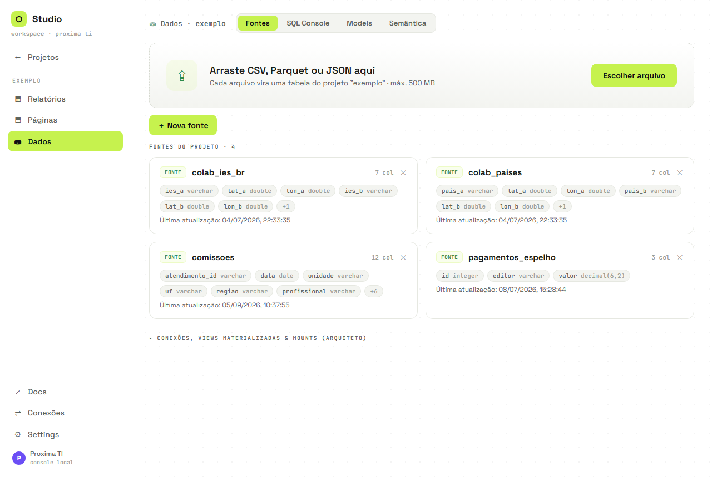
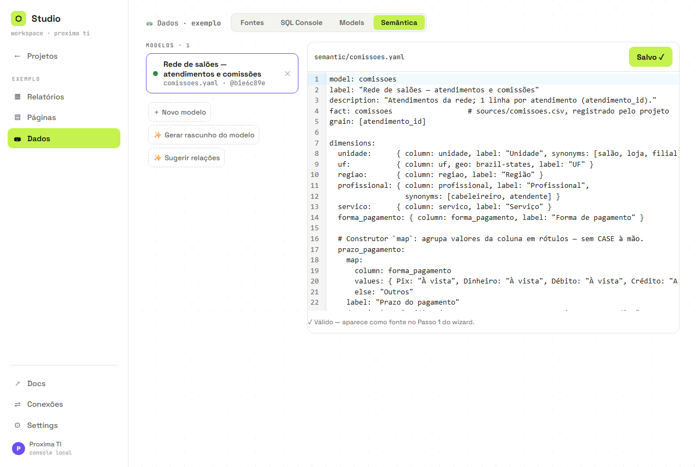

# Guia do arquiteto — Studio Console

O par deste guia é o [GUIA_RELATORIOS.md](GUIA_RELATORIOS.md) (o dia a dia do analista:
montar relatórios). Aqui está o trabalho de **fundação** que faz aquele dia a dia ser
seguro e simples: conexões, fontes, segredos, o catálogo semântico e as políticas.

> **A divisão de papéis** (convenção do console, sem auth): o **arquiteto** declara a
> verdade — de onde vêm os dados, o que as métricas significam, o que pode ser exposto.
> O **analista** consome — escolhe do catálogo, nunca escreve SQL nem vê credencial.
> Tudo que o arquiteto declara é **versionável e sem segredos**; todo segredo é
> write-only e nunca volta pela API (nem em mensagem de erro — elas são redigidas).

---

## 1. Conexões globais (menu ⇌ Conexões)

Registro no **nível da instalação**: cadastre o banco uma vez, use em N projetos.
O export/clone de um projeto leva só o **nome** da conexão — nunca a credencial.

A tela lista cada conexão como um card com o tipo, em quais projetos ela é usada e as
ações **Testar · 🔑 Senha · Editar · Excluir**.

1. **＋ Nova conexão** — tipo (`postgres · mysql · sqlite · duckdb`), host, database,
   usuário. **Sem senha aqui**: o cadastro vai para `connections.yaml` (versionável) e o
   validador **recusa** qualquer coisa que pareça segredo.
2. **🔑 Senha** — write-only: entra e nunca é exibida de volta. Digite **só a senha**
   (host/porta/database/usuário vêm do cadastro); alternativa: uma connection string
   completa. Em produção, a variável `STUDIO_SECRET_<NOME>` tem precedência sobre o
   arquivo.
3. **Testar** — ATTACH numa instância efêmera. Erros de driver voltam **redigidos**
   (`password=***`); na primeira vez o DuckDB baixa a extensão do banco (se a rede
   corromper o download — "not a GZIP stream" — o console re-tenta com `FORCE INSTALL`).
4. **Excluir** — mostra ANTES quais projetos/fontes dependem da conexão.

## 2. Fontes do projeto (Dados › Fontes)



**＋ Nova fonte** oferece os três tipos:

| Tipo | Origem | Atualiza | O runtime lê |
|---|---|---|---|
| **Arquivo** | upload CSV/Parquet/JSON | re-upload | a view registrada no schema do projeto |
| **View materializada** | conexão global + SQL | **↻** (manual) | o **parquet local** extraído |
| **Mount** | pasta local/UNC ou http(s)/s3 | quem escreve lá (Airflow etc.) | `read_parquet(url)` — ☁ lê a URL direto |

- **View materializada**: escolha a conexão → escreva a query → **▶ Preview** (100
  linhas, sem extrair tudo) → nomeie → materializar. O **↻** re-extrai com **swap
  atômico** (`.tmp` → rename): refresh que falha nunca corrompe o parquet em uso —
  grava `last_error` (redigido) e preserva o timestamp bom. `stale_after` (ex.: `7d`)
  liga o badge "possivelmente desatualizada".
- **Mount**: o publish ☁ **não copia** o parquet — o app lê a URL; sobrescreveram o
  arquivo no bucket/pasta, o app publicado reflete no reload, sem republicar.
- **Regra inviolável (`live-scan`)**: página **nunca** acessa banco externo em runtime —
  `ATTACH`/`postgres_scan` em query de página é **erro** nos dois publishes e no lint.
  Banco externo entra materializado ou montado; o SQL Console segue livre (é seu espaço
  de exploração).

## 3. project.yaml e segredos do projeto

`projects/<p>/project.yaml` declara fontes materializadas, mounts e deploy — é
**versionável**, e o validador recusa salvar qualquer credencial inline (connection
string com senha, chaves AWS, tokens), apontando o caminho certo: `.secrets.json`
(gitignored, write-only via `PUT /:p/secrets`, referenciado por `credentials_ref`,
sobreponível por `STUDIO_SECRET_<REF>`).

## 4. O catálogo semântico (Dados › Semântica) — o coração do papel

É aqui que "receita" vira `faturamento` para todo mundo, e que a LGPD vira
compilação em vez de revisão manual.



**Ciclo de trabalho:**

1. **✨ Gerar rascunho do modelo** — a heurística roda UMA vez sobre uma fonte e emite o
   YAML para a sua revisão (com `description` de rascunho). Depois disso, o compilador
   só obedece o declarado.
2. **Revisar e enriquecer** — o save valida com erros por caminho, e com a fonte
   registrada confere as **colunas reais** (`"valorr" não existe… coluna próxima:
   valor`). O que um modelo maduro declara:

   | Recurso | Para quê |
   |---|---|
   | `label` / `fmt` / `description` / `synonyms` | rótulos prontos p/ o analista; grounding do agente ("receita"→`faturamento`) |
   | `metrics.filters` embutidos | KPIs filtrados (`faturamento_2025`) num scan só |
   | `derived` + `total(m[, scope: all])` | percentuais certos no filtrado ou no universo |
   | `lag / acum / movel` no derived | YoY, YTD e média móvel sem SQL |
   | `bins` / `map` | faixas e de-para sem CASE livre |
   | `joins` + `cardinality` | 1→N + soma = **erro de fan-out** (nada de valor dobrado silencioso) |
   | `semi_additive` | saldo não soma ao longo do tempo (erro educativo) |
   | `hierarchy` (tempo) e `hierarchies` (entre dims) | níveis e drill ⤵/⤴ |
   | `pii` + `policies.expose` | o que jamais sai em publish público |

3. **✨ Sugerir relações** — sondas determinísticas nos SEUS dados (dependência
   funcional + cardinalidade) propõem hierarquias e cardinalidades **com evidência**
   ("uf → regiao: 0 violações em 1.338 linhas"). Você ratifica item a item; nada entra
   no YAML sem aceite. Funciona sem LLM.
4. **Proveniência**: todo SQL compilado carrega `-- semantic: <modelo>@<hash>`. Mudou o
   catálogo → muda o hash → páginas e relatórios acusam `desatualizado` e um build
   resolve. É o seu lineage barato.

## 5. Políticas e publicação

- Dimensão `pii: true` (ou `expose: internal`) é **recusada em compilação** no publish
  público — nas páginas, nos planos do agente ✨ e como destino de drill. Publique como
  **interno** para painéis autenticados. Recusa é sempre **erro com mensagem**, nunca
  omissão silenciosa.
- Dimensão calculada (`bins`/`map`) sobre coluna de dim interna **herda** a política —
  sem vazamento por derivação.
- O agente nunca gera SQL: sobre fonte semântica ele só escolhe nomes do catálogo (que o
  servidor carrega — o browser não dita o conteúdo), e proposta fora do catálogo é
  rejeitada e re-pedida.

## 6. Governança dos relatórios spec-driven

O analista vive nos relatórios; o arquiteto governa os **estados** (detalhes de fluxo no
[GUIA_RELATORIOS.md](GUIA_RELATORIOS.md)):

- A spec (`reports/<slug>.md`, fence ```` ```studio-report ````) é a fonte; páginas são
  build. **Posse é única** — uma página pertence a no máximo uma spec.
- `desatualizado` = o SEU catálogo mudou → oriente um ⚡ Build (livre).
- `divergente` = alguém editou a página à mão → decisão explícita: ↻ Recompilar (spec
  vence) ou ⬇ Reabsorver (página vence; prosa manual só entra com confirmação).
- Salvar página possuída é **transacional** com o sync da spec: se a spec estiver
  quebrada a ponto de o sync falhar, a gravação é desfeita e o erro aponta a aba
  Diagnósticos — conserte a spec primeiro.

## 7. Checklist — projeto novo do zero

1. **⇌ Conexões**: cadastre o banco (sem senha) → 🔑 grave a senha → **Testar**.
2. **Projeto** → Dados › Fontes → **＋ Nova fonte › View materializada** (ou mount) →
   ▶ Preview → materializar. Confira o badge de frescor.
3. **Dados › Semântica** → ✨ Gerar rascunho → revise: labels, fmt, descriptions,
   synonyms, pii/policies, joins com cardinality.
4. **✨ Sugerir relações** → ratifique hierarquias (habilita o drill do analista).
5. Valide o grounding: wizard semântico, barra ✨, pergunte "receita por
   salão" — deve resolver sem retry.
6. Entregue ao analista: ele cria relatórios pelo ✨ ou wizard; PII e SQL já estão
   guardados por construção. Publishes públicos aplicarão suas políticas sozinhos.

## Regras de ouro do arquiteto

- **Segredo nunca em YAML** — cadastro versionável + senha write-only; erros de API são
  redigidos, mas a primeira linha de defesa é sua.
- **Banco externo nunca em página** — materialize ou monte.
- **Declare, não conserte**: cardinalidade, semi-aditividade e políticas transformam
  erro silencioso de dados em erro de compilação com mensagem.
- **Ratifique a inferência**: as sondas propõem com evidência; a verdade entra no YAML
  só com o seu aceite.
