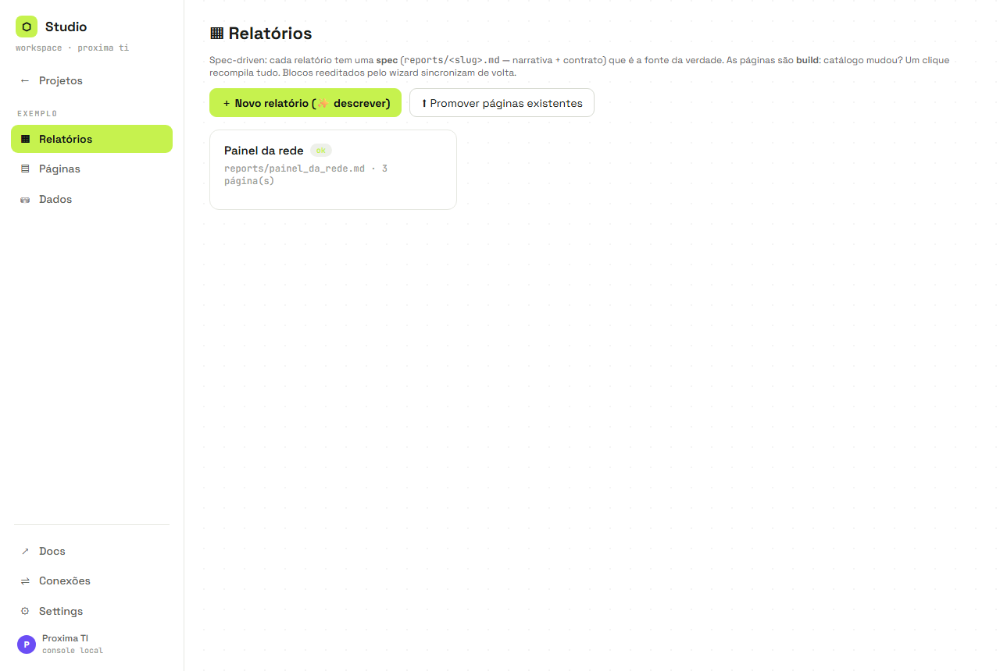
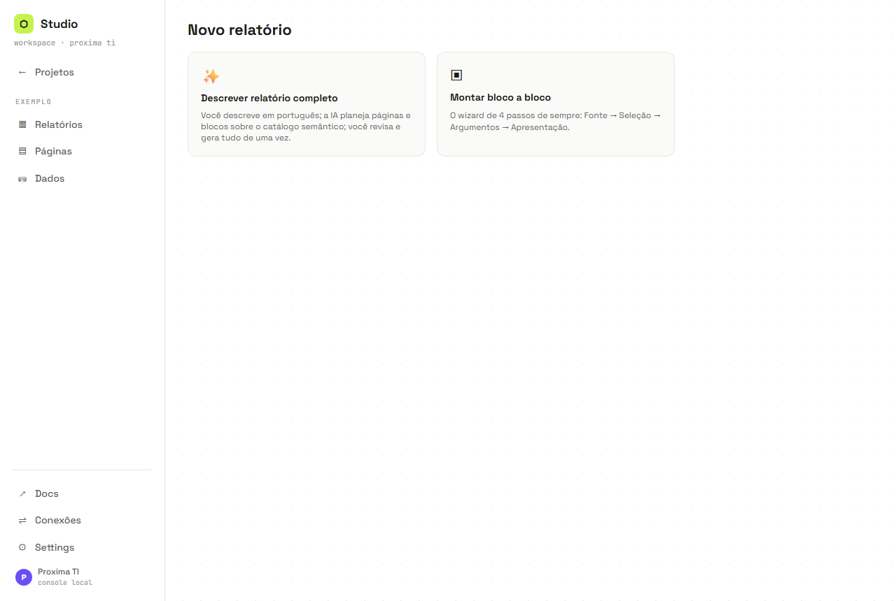
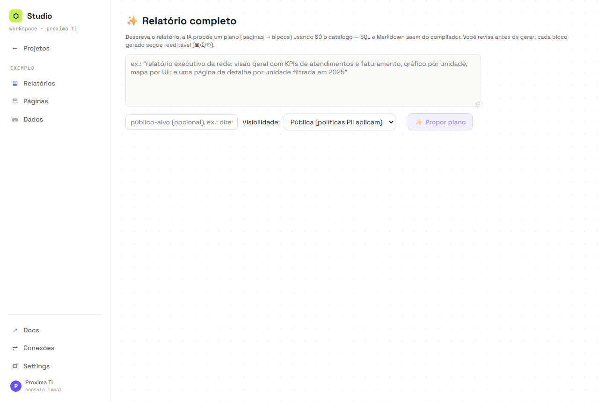
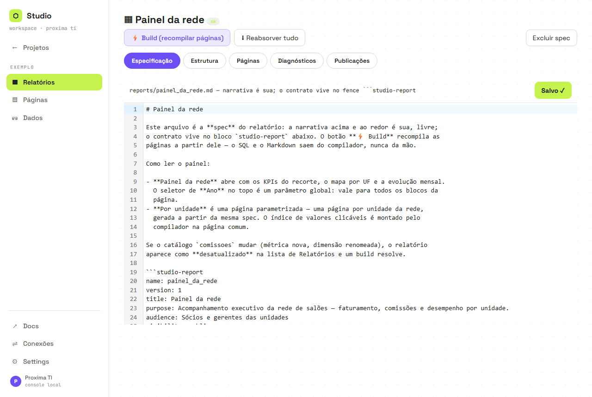
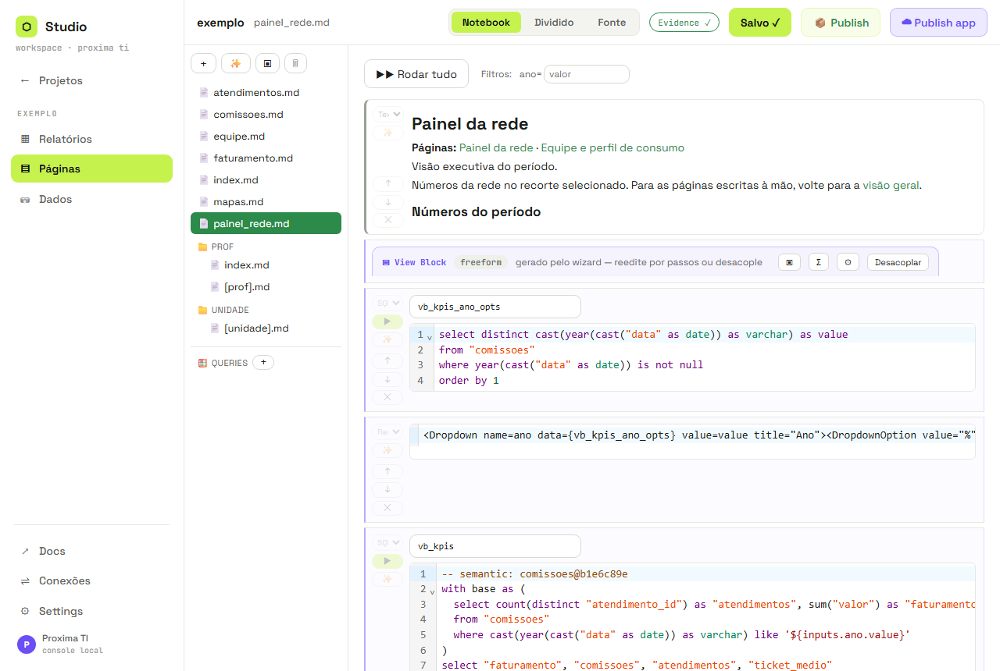
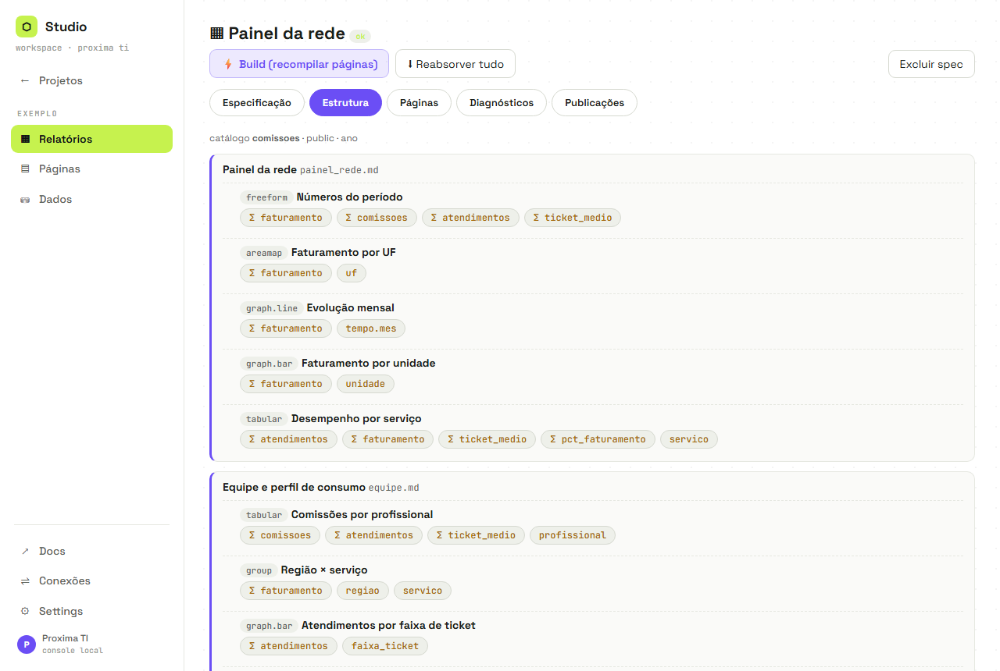
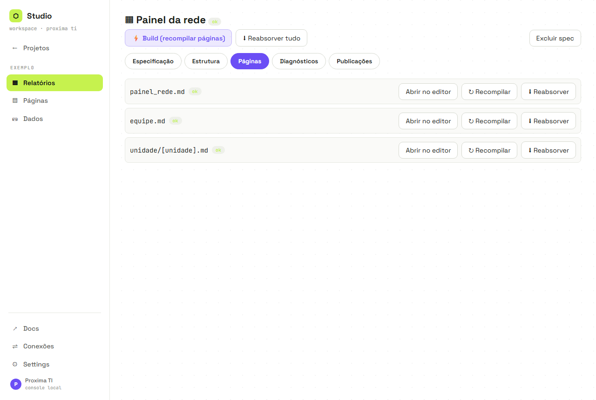

# Guia rápido — relatórios no Studio Console

Este guia mostra dois caminhos:

- **Relatório simples:** uma página com indicadores, tabela ou gráfico.
- **Relatório composto (composite):** várias páginas, navegação e páginas parametrizadas reunidas em uma única spec.

> **Conceito central:** a spec é a fonte; as páginas são build.  
> Cada relatório vive em `projects/<projeto>/reports/<nome>.md`, com narrativa Markdown e um contrato YAML. As páginas executáveis ficam em `pages/` e são produzidas pelo compilador.

## Antes de começar

O projeto precisa ter uma fonte em **Dados → Fontes**, um modelo válido em **Dados → Semântica** e, para descrever o relatório em português, um agente configurado em **Settings → Agente**.

No menu do projeto, abra **Relatórios**:



---

## 1. Criar um relatório simples

### Passo 1 — Iniciar

Em **Relatórios**, clique em **+ Novo relatório (✨ descrever)**.



- **Descrever relatório completo:** o agente propõe a estrutura usando o catálogo semântico.
- **Montar bloco a bloco:** abre o wizard manual de Fonte → Seleção → Argumentos → Apresentação.

Para este exemplo, escolha **Descrever relatório completo**.

### Passo 2 — Descrever o objetivo

Escreva o resultado esperado em linguagem natural. Exemplo:

> Crie uma página executiva com o total de atendimentos, o faturamento e um gráfico de barras por unidade. Permita filtrar por ano.

Escolha também o público-alvo e a visibilidade. A opção **Pública** aplica as políticas de PII; use **Interna** quando o relatório puder utilizar dimensões internas.



Clique em **✨ Propor plano**.

### Passo 3 — Revisar o plano

O agente propõe páginas e blocos usando somente nomes existentes no catálogo: métricas, dimensões, filtros, estilos e páginas parametrizadas.

Antes de gerar, você pode:

- desmarcar páginas ou blocos;
- ler avisos e ambiguidades;
- pedir outra proposta, por exemplo: “troque o mapa por tabela”.

SQL e Markdown executável não vêm do agente: são produzidos pelos compiladores depois da aprovação.

### Passo 4 — Gerar

Clique em **Gerar**. O Studio valida o plano, compila as páginas, executa lint e políticas, testa todas as queries, grava a spec e materializa as páginas.

Ao terminar, você chega à tela do relatório:



### Passo 5 — Ajustar

Há duas formas seguras:

- **Pela spec:** altere narrativa ou YAML, salve e clique em **Build**.
- **Pelo View Block:** em **Páginas → Abrir no editor**, use o wizard do bloco. Ao salvar, sua estrutura sincroniza de volta para a spec.



### Passo 6 — Publicar

Na aba **Publicações**, escolha:

- **Snapshot:** HTML único para entrega offline.
- **App:** Parquet + DuckDB-WASM, com filtros e SQL no navegador.

Páginas parametrizadas são publicadas pelo modo **App**.

---

## 2. Criar um relatório composto (composite)

Um relatório composto possui várias páginas sob uma única spec. O compilador cria a navegação entre elas e um índice para páginas parametrizadas.

Exemplo de pedido:

> Crie um relatório executivo com uma visão geral contendo KPIs, evolução anual e mapa por UF; uma página de distribuição por serviço; e uma página parametrizada por unidade com o detalhe dos atendimentos.

Estrutura esperada:

```text
Relatório da rede
├── Visão geral
├── Serviços
└── Unidade
    └── [unidade].md
```

### Caminho A — Criar do zero com o agente

1. Abra **Relatórios → + Novo relatório**.
2. Descreva explicitamente as páginas desejadas.
3. Confira a árvore de páginas e blocos.
4. Gere o relatório.

O compilador adiciona a barra de navegação, o índice de valores para páginas parametrizadas e links compatíveis com editor e Publish App.

### Caminho B — Reunir páginas existentes

1. Abra **Relatórios**.
2. Clique em **Promover páginas existentes**.
3. Informe o nome do relatório.
4. Informe os arquivos separados por vírgula:

```text
painel_rede.md, equipe.md, unidade/[unidade].md
```

Somente páginas com View Blocks semânticos podem ser promovidas automaticamente. Seus marcadores permitem reconstruir métricas, dimensões, filtros, estilos e parâmetros.

### Estrutura do composto

A aba **Estrutura** mostra páginas e blocos sem exigir leitura do YAML:



### Controle das páginas

A aba **Páginas** mostra o estado de cada arquivo:



- **Abrir no editor:** abre o Markdown executável.
- **Recompilar:** a spec vence e a página é reconstruída.
- **Reabsorver:** a página vence; View Blocks e prosa reconhecida voltam para a spec.

> Composite significa composição por posse e navegação. Não há transclusão: o conteúdo de uma página não é renderizado dentro de outra.

---

## 3. Anatomia da spec

```yaml
name: painel_da_rede
version: 1
title: Painel da rede
purpose: Visão executiva da rede de salões
visibility: public
catalog: comissoes
globalParams:
  - { name: ano, type: enum, from: tempo.ano, default: "%", label: Ano }
pages:
  - path: index.md
    title: Visão geral
    prose: Contexto para o leitor.
    blocks:
      - { id: indicadores, metrics: [atendimentos, faturamento], dims: [], filters: [], style: freeform }
      - { id: por_unidade, metrics: [faturamento], dims: [{ dim: unidade }], filters: [], style: graph.bar }
  - path: "[unidade].md"
    title: Detalhe da unidade
    parameter: { name: unidade, dimension: unidade }
    blocks:
      - { id: servicos, metrics: [atendimentos], dims: [{ dim: servico }], filters: [], style: tabular }
warnings: []
```

Estilos planejáveis pelo agente: `freeform`, `tabular`, `graph.bar`, `graph.line`, `group` e `areamap`. Papéis, pivot e nested continuam disponíveis no wizard manual.

## 4. Entender os estados

| Estado | Significado | Ação recomendada |
|---|---|---|
| `ok` | Páginas correspondem ao build atual | Nenhuma |
| `pendente` | A spec mudou ou falta gerar uma página | Build |
| `divergente` | A página foi editada depois do build | Recompilar ou Reabsorver |
| `desatualizado` | O catálogo semântico mudou | Revisar e executar Build |
| `quebrado` | A spec contém erros | Abrir Diagnósticos |

## 5. Regras de ouro

1. Prefira alterar o relatório pela spec ou pelo wizard do View Block.
2. Não escreva manualmente o marcador `viewblock`.
3. Não coloque SQL no contrato da spec.
4. Uma página pertence a no máximo uma spec.
5. Confira **Diagnósticos** antes de publicar.
6. Valide o resultado no editor, Snapshot e Publish App.

## 6. Quando usar cada abordagem

| Necessidade | Caminho indicado |
|---|---|
| Uma análise rápida | Wizard bloco a bloco |
| Uma página executiva | Descrever relatório completo |
| Produto com várias páginas | Relatório composto |
| Reunir páginas já construídas | Promover páginas existentes |
| Ajustar apenas um gráfico | Abrir View Block no editor |
| Alterar a arquitetura do relatório | Editar a spec |

